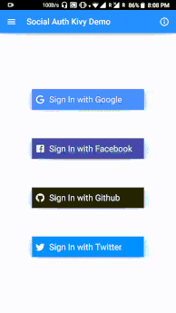

# social-auth-kivy
#### *Integrate Google, Facebook, Github &amp; Twitter login in kivy applications*



### Note:
* Google and Facebook logins have been implemented natively. See [docs](docs/integrate-google-facebook-login.md) for implementation.
* Firebase has been used for integrating Github and Twitter logins

### Build Yourself
* Create OAuth apps in the developer section of the provider you want to integrate login with
* For using firebase in kivy applications, we need to tweak few settings internally:
  * Build your application once, doesn't matter if it crashes
  * Then find *build.tmpl.gradle* inside *.buildozer/android/platform/build-armeabi-v7a/dists/app-name__armeabi-v7a/templates/* and change gradle plugin version from 3.1.4 to 3.5.2(I've already created a PR for the same in p4a. Hope they merge it) and add google-services plugin as it's required by firebase and apply plugin:
  ```java
  buildscript {
    repositories {
       //...
    }
    dependencies {
        //make sure its 3.5.2 here instead of 3.1.4 
        classpath 'com.android.tools.build:gradle:3.5.2'
        
        //google-services plugin, required by firebase
        classpath 'com.google.gms:google-services:4.3.3'
    }
  }
  
  //...
  
  // At the bottom
  apply plugin: 'com.google.gms.google-services'
  ```
  * Make sure gradle version is set to latest(6.4.1) inside *gradle-wrapper.properties*(It's been updated in develop branch. If you're using master branch of p4a, you may need to update it manually). This file is located at: *.buildozer/android/platform/build-armeabi-v7a/dists/app-name__armeabi-v7a/gradle/wrapper/*
  
  * Copy your *google-services.json* inside *.buildozer/android/platform/build-armeabi-v7a/dists/app-name__armeabi-v7a/*. Its required for firebase authentication.

* Re-build your application and if everything goes well, it should work.

### Releases:
* Contains a debug apk in [bin](https://github.com/shashi278/social-auth-kivy/tree/master/bin) directory.

### TODO:
* I'm not sure why `AsyncImage` is not working for me and not showing any profile picture.

##
Feel free to ping me or raise issues if there's any difficulty in packaging it up.

Star and fork my work if you think it's useful.
